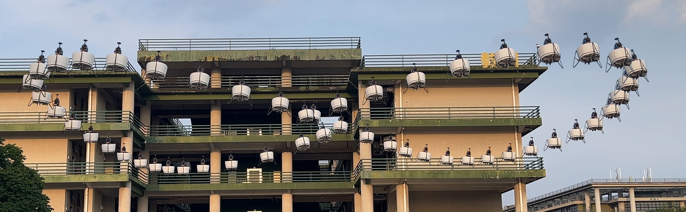

# Object Overlay

从视频中提取同一对象在不同时刻的位置，并合成为一张叠加图。工具不限定对象类别；仓库中的无人机只是一个使用样例。



## 安装与部署

uv 支持 Windows、Linux 和 macOS。项目的使用方式相同，只有 uv 的安装命令因系统而异。

### Windows

```powershell
powershell -ExecutionPolicy ByPass -c "irm https://astral.sh/uv/install.ps1 | iex"
```

也可以使用 Windows 包管理器：

```powershell
winget install --id=astral-sh.uv -e
```

### Linux

```bash
curl -LsSf https://astral.sh/uv/install.sh | sh
```

### macOS

```bash
curl -LsSf https://astral.sh/uv/install.sh | sh
```

安装完成后，进入项目目录并同步环境：

```console
uv sync
```

`uv` 会根据 `.python-version` 和 `uv.lock` 管理 Python、虚拟环境及项目依赖，不需要手动创建或激活虚拟环境。程序优先使用系统 FFmpeg；未安装时会使用项目依赖提供的 FFmpeg。其他安装方式见 [uv 官方安装文档](https://docs.astral.sh/uv/getting-started/installation/)。

## 使用

把自己的视频放在任意位置，然后运行：

```console
uv run object-overlay "path/to/input.mp4" --interval 0.5 --select --output-dir "path/to/input_overlay"
```

适合自动识别的素材应当使用固定或基本固定的镜头，并且画面中有一个主要运动对象。`--interval 0.5` 表示每 0.5 秒提供一个候选位置。

筛选窗口按键：

| 按键 | 功能 |
| --- | --- |
| Enter 或空格 | 纳入当前对象 |
| `S` | 跳过当前对象 |
| `B` 或 Backspace | 回退上一帧并重新选择 |
| `M` | 自动 Mask 不准确时，手动框选并修正 |
| `R` | 放弃当前人工修正，恢复自动 Mask |
| `Q` 或 Esc | 取消本次选择 |

当前候选对象显示为绿色；已经纳入的对象会以原始颜色留在后续预览中。全部候选处理完毕后，按 Enter 或空格生成结果。

主要结果是输出目录中的 `overlay_selected.png`。抽帧、Mask 和元数据属于可复用的运行产物；每次执行 `--select` 都会重新选择要纳入的时刻。

## 无人机样例

本地将视频放入 `examples\drone\input\` 后，可运行：

```console
uv run object-overlay "./examples/drone/input/drone_1.mp4" --interval 0.5 --select --output-dir "./examples/drone/output/drone_1_selected"
```

样例的输入视频和中间产物已由 `.gitignore` 忽略，仓库只保留最终示例图。

查看所有参数：

```console
uv run object-overlay --help
```

## 项目结构

```text
src/object_overlay/   核心代码
examples/drone/       无人机样例
tests/                核心功能测试
```
